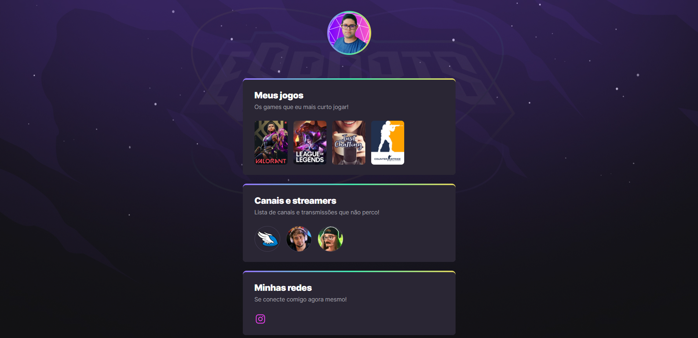

# &#127918; NLW eSports &#127918;	

 > Trilha Explorer

Projeto construído no evento Next Level Week (NLW) da Rocketseat

[&#128279; Clique aqui para visualizar](https://777diegoribeiro777.github.io/nlw-esports-explorer/)

## &#128204; Objetivos
Neste evento o objetivo era criar uma arvore de links personalizada com o tema games.

## &#128187; Tecnologias
 - HTML
 - CSS
 - GIT e Github

## &#128222; Contato 
- [E-mail](diegoaribeiro1910@gmail.com)
- [Linkedin](https://www.linkedin.com/in/diego-ribeiro-127590237/)
